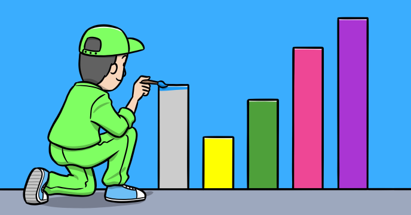

Data visualization via charts and graphs is a very efficient technique for putting a meaning to otherwise abstract data. In professional programming, developers are usually using dedicated libraries to visualize data.

In this tutorial we’ll build ourselves a very basic data visualization function that we can use to create bar charts.
 
## Source code 
The JavaScript source code of this program can be found [here](sketches/program.js). To run it, you need to import it in the [codeguppy.com](https://codeguppy.com) online editor. Alternatively, you can use the source code in your p5.js sketches (advanced use). 
## Online version 
To see the code running, check the online playground at [https://codeguppy.com/code.html?t=bar_chart](https://codeguppy.com/code.html?t=bar_chart) 
## Next steps 
Please check [codeguppy.com](https://codeguppy.com) for many other fun JavaScript programs and games for beginners. To stay up to date with CodeGuppy development please follow [@codeguppy](https://twitter.com/codeguppy) on Twitter.  
